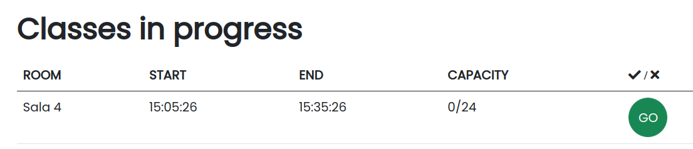

## Some Examples

Example of some tasks during development

 

Chatting between client and trainer
* client 
 
 

* trainer 
 
 

Sign-up on app  

 

After sign-up, the user stays logged in 

 

Available class

 

Enroll for the class (all these updates are done in real time)

 

Add a new class (available for trainers)

 

Fill the form to add the class  

 

After adding the class, the class appears in the list

 

Edit an existing class  

 

After edditing the class, the class appears edited in the list

 